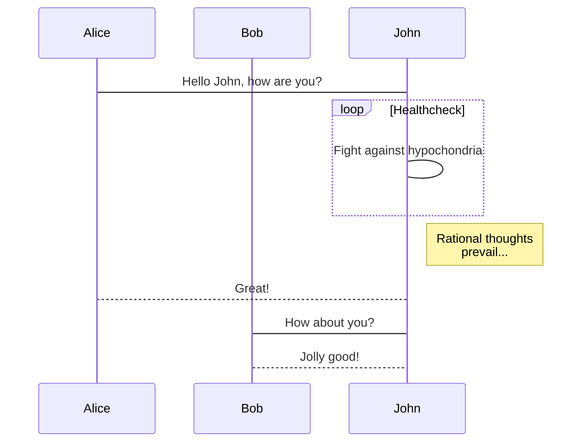

# demo-fileupload-vue

> A Vue.js project

## Build Setup

``` bash
# install dependencies
npm install

# serve with hot reload at localhost:8080
npm run dev

# build for production with minification
npm run build

# build for production and view the bundle analyzer report
npm run build --report
```

For a detailed explanation on how things work, check out the [guide](http://vuejs-templates.github.io/webpack/) and [docs for vue-loader](http://vuejs.github.io/vue-loader).

## Functions

### helloWorld

``` text
curl -v "https://us-central1-project*********.cloudfunctions.net/helloWorld"
```

### addMemo

``` text
curl -v -X POST -H "Content-Type:application/json" "https://us-central1-project*********.cloudfunctions.net/addMemo" -d @new_memo.json
```

``` json
{
  "title": "test title",
  "description": "test description",
  "platforms": ["A", "B"],
  "million": false,
  "releasedAt": "2018-05-01"
}
```

### fileupload

``` text
curl -v -X POST "https://us-central1-project*********.cloudfunctions.net/fileupload" -F "file=@logo.png;type=image/png"
```

``` text
curl -v -X POST "https://us-central1-project*********.cloudfunctions.net/fileupload" -F "file1=@test1.jpg;type=image/jpg" -F "file2=@test2.png;type=image/png"
```

### filedownload

``` text
curl -v "https://us-central1-project*********.cloudfunctions.net/filedownload?file={file_name}"
```

## Hosting

``` text
https://project*********.firebaseapp.com
```

### rewrites

#### /hello

Functions: helloWorld

``` text
curl -v "https://project*********.firebaseapp.com/hello"
```

#### /upload

Functions: fileupload

``` text
curl -v -X POST "https://project*********.firebaseapp.com/upload" -F "file=@logo.png;type=image/png"
```

#### /download

``` text
curl -v "https://project*********.firebaseapp.com/download?file={file_name}"
```

## mermaid demo

[mermaid.js](https://mermaidjs.github.io/)


